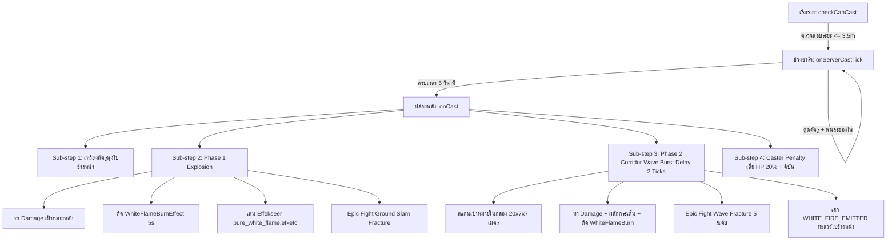
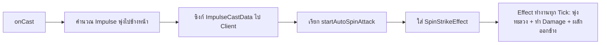
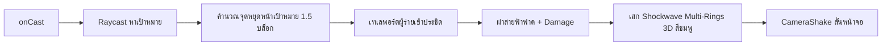
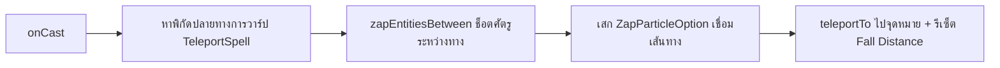
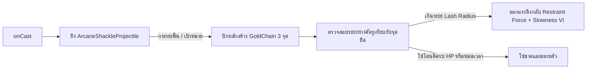

# ⚙️ โครงสร้างการทำงานของแต่ละเวทมนตร์ (Spell Mechanics & Execution Flow)

เอกสารนี้อธิบายวงจรการทำงานเชิงลึก (Lifecycle), เมธอดที่เกี่ยวข้อง, การคำนวณคณิตศาสตร์ และระบบภายนอกที่แต่ละ Spell เรียกใช้งาน

---

## 1. PureWhiteFlameBurstSpell (`pure_white_flame_burst`)

### ลำดับขั้นตอนการทำงาน (Execution Lifecycle)

### รายละเอียดการเรียกใช้และการคำนวณ:
1. **การตรวจสอบเป้าหมาย (`checkCanCast`)**:
   - ใช้ `Utils.raycastForEntity` ในระยะ Melee Strict (3.5 บล็อก)
   - หากไม่พบเป้าหมาย หรือเป้าหมายเป็นพันธมิตร จะไม่อนุญาตให้เริ่มร่าย
2. **การดูดเป้าหมาย (`onServerCastTick`)**:
   - ดึงศัตรูเข้ามาอยู่ในระยะ 1.2 บล็อกด้านหน้าผู้ร่ายอย่างต่อเนื่อง
   - ให้ผล Slowness แก่ทั้งผู้ร่ายและเป้าหมายเพื่อตรึงตำแหน่ง
   - พ่นอนุภาค `ParticleRegistry.WHITE_FIRE_EMITTER` และควัน
3. **การเหวี่ยงและระเบิดปฐมภูมิ (Phase 1 Impact)**:
   - ผลักศัตรูพุ่งไปข้างหน้าด้วยเวกเตอร์ `flingVelocity = forward * 1.5 + up * 0.15`
   - เรียกความเสียหาย `DamageSources.applyDamage`
   - เรียกใช้ **WhiteFlameBurnEffect** (`100 Ticks`, ปิดฟองยา, เปิดไอคอน)
   - เรียกใช้ **AAALevel** (Effekseer API): โหลด `pure_white_flame.efkefc` พร้อมหมุนแกน Roll 180° (`Math.PI`) เพื่อให้เปลวไฟตั้งขึ้นถูกทิศทาง และปรับระนาบ Y ลงพื้นดิน (`-1.0`)
   - เรียกใช้ **Epic Fight API**: `LevelUtil.circleSlamFracture` รัศมี 3.5 บล็อก โดยมีระบบค้นหาพื้นทึบในแนวดิ่ง (`findSolidGroundY`) ตรวจสอบช่วง +3 ถึง -8 บล็อก
4. **คลื่นระเบิดแนวยาว (Phase 2 Corridor Wave)**:
   - หน่วงเวลา 2 Ticks ผ่าน `serverLevel.getServer().tell(new TickTask(...))`
   - คำนวณขอบเขตสี่เหลี่ยมผืนผ้าแบบหมุนตามมุมกล้อง (Oriented Bounding Box: OBB) ขนาด **ยาว 20ม. x กว้าง 7ม. x สูง 7ม.**
   - ศัตรูในกล่องจะโดน Knockback พุ่งไปข้างหน้าอย่างรุนแรง (`f.scale(1.8).add(0, 0.45, 0)`)
   - ยิงคลื่นแตกร้าวแบบ Rapid Forward Ground Fracture 5 สเต็ป ห่างกันสเต็ปละ 4 บล็อก ดีเลย์จุดละ 1 Tick
5. **บทลงโทษผู้ร่าย (Caster Penalty)**:
   - ลดเลือด 20% ของเลือดปัจจุบัน: `entity.setHealth(Math.max(1.0F, health - hpCost))`
   - ติด Slowness III (10s), Wither I (5s), Weakness I (30s)

---

## 2. SpinStrikeSpell (`spin_strike`)

### ลำดับขั้นตอนการทำงาน:

### รายละเอียดการเรียกใช้:
1. **การคำนวณแรงพุ่ง (`onCast`)**:
   - ดึงมุมมอง `entity.getLookAngle()` ปรับองศาไม่ให้กดหัวทิ่มพื้น (`upwardness.dot`)
   - สเกลความเร็วพุ่ง `2.5 * multiplier`
2. **การทำงานของ `SpinStrikeEffect` (Tick-based)**:
   - หมุนตัวต่อเนื่อง `player.startAutoSpinAttack(10)`
   - คงความเร็วพุ่งไปข้างหน้าทุก Tick: `entity.setDeltaMovement(dashVelocity)`
   - สแกนเป้าหมายด้วย AABB ขยายขนาด (`inflate(1.2, 0.6, 1.2)`)
   - เมื่อชนศัตรู: สร้างความเสียหายตามพลังเวท และผลักกระเด็นออกด้านข้าง (`lateral knockback`) พร้อมให้ `invulnerableTime = 20` ป้องกันดาเมจเบิ้ล
   - เมื่อชนกำแพงบล็อก (`horizontalCollision`): ยกเลิกเอฟเฟกต์ทันทีและรีเซ็ต Fall Distance

---

## 3. LightningStrikeSpell (`lightning_strike`)

### ลำดับขั้นตอนการทำงาน:

### รายละเอียดการเรียกใช้:
1. **การหาตำแหน่งปลายทาง**:
   - ใช้ `Utils.raycastForEntity` ระยะตาม Spell Power
   - คำนวณจุดยืนปลายทางถอยร่นออกจากเป้าหมาย 1.5 บล็อก เพื่อไม่ให้ตัวโมเดลซ้อนทับกัน
2. **ระบบ Particle เฉพาะตัว**:
   - เสก `ShockwaveParticleOptionCustom`: คลื่นวงแหวนช็อคเวฟ 3 มิติ วางระนาบตั้งฉากตามทิศทางพุ่ง 100% (สี Hot Pink / Electric Magenta)
   - สุ่มเส้นสายฟ้าแลบ `ZapParticleOptionCustom` พุ่งออกจากเป้าหมาย
3. **การสั่นหน้าจอ (`CameraShakeManager`)**:
   - ส่งแพ็กเก็ตสั่นหน้าจอให้ผู้เล่นใกล้เคียง เพิ่มความสมจริงในจังหวะกระแทก

---

## 4. ThunderStepSpell (`thunder_step`)

### ลำดับขั้นตอนการทำงาน:

### รายละเอียดการเรียกใช้:
1. **การคำนวณเส้นทางการวาร์ป**:
   - ดึงพิกัดจาก `TeleportSpell.findTeleportLocation`
2. **การทำลายล้างระหว่างทาง (`zapEntitiesBetween`)**:
   - สร้าง AABB เชื่อมโยงจากจุดเริ่มต้นไปยังจุดปลายทาง
   - ตรวจสอบการตัดผ่านของเส้นสายตาและระดับเท้า (`checkEntityIntersecting`)
   - ศัตรูที่ยืนขวางแนววาร์ปจะได้รับความเสียหายสายฟ้าทันที
3. **เอฟเฟกต์และการวาร์ป**:
   - สร้างเส้นสายฟ้า Zap แบบสุ่ม 7 เส้นระหว่างจุดเดิมถึงจุดใหม่
   - สั่งเทเลพอร์ตและรีเซ็ต Fall Distance

---

## 5. ShackleofFearSpell (`shackle_of_fear`)

### ลำดับขั้นตอนการทำงาน:

### รายละเอียดการเรียกใช้:
1. **กระสุนเวทมนตร์ (`ArcaneShackleProjectile`)**:
   - สืบทอดจาก `AbstractMagicProjectile` มีแรงโน้มถ่วงสมจริง (Gravity 0.06, Speed 1.2)
2. **เอนทิตีโซ่ตรวน (`GoldChain`)**:
   - ประกอบด้วยชิ้นส่วน Multi-part (`GoldChainPart`) สำหรับรับดาเมจแยกชิ้น
   - มีระบบฟิสิกส์ดึงกลับ (Tether Restraint Physics) หากศัตรูพยายามเดินออกนอกรัศมี
   - สลายตัวเมื่อหมดเวลา (`chainLifetime`) หรือพลังชีวิตโซ่หมดลง (`chainHealth`)
