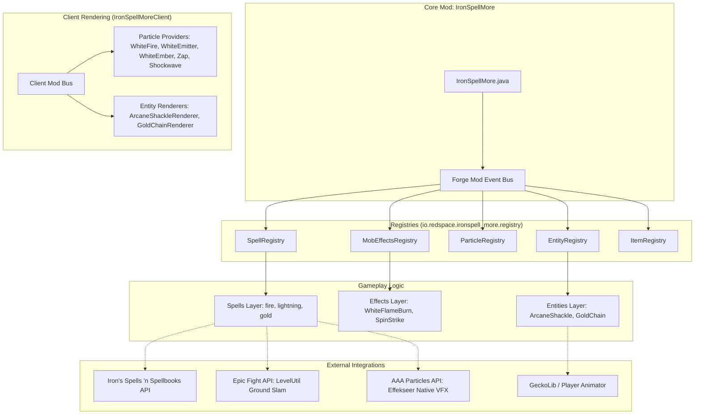

# 🏗️ โครงสร้างระบบทั้งหมด (Overall System Architecture)

เอกสารสรุปสถาปัตยกรรมโครงสร้างระบบของ Mod **IronSpell More** (Forge 1.20.1) การจัดหมวดหมู่คลาส ระบบรีจิสทรี และการเชื่อมต่อกับระบบภายนอก

---

## 1. แผนผังภาพรวมของระบบ (System Overview Diagram)



---

## 2. โครงสร้างแพ็กเกจของโปรเจกต์ (Package Structure)

```
io.redspace.ironspell_more
│
├── IronSpellMore.java                      # จุดเริ่มต้นของ Mod (Main Entry Point)
│
├── client/                                 # ระบบการแสดงผลฝั่ง Client
│   ├── IronSpellMoreClient.java            # ลงทะเบียน Particle Providers & Entity Renderers
│   └── particle/                           # ตรรกะของ Particle แต่ละตัว
│       ├── WhiteFireParticle.java          # เปลวไฟสีขาวแบบอนิเมชั่น 8 เฟรม
│       ├── WhiteFireEmitterParticle.java   # เปลวไฟสีขาวต่อเนื่อง + ทิ้งสะเก็ดไฟตามหลัง
│       ├── WhiteEmberParticle.java         # สะเก็ดไฟสีขาว
│       ├── ZapParticleCustom.java          # ประกายสายฟ้าแบบคัสตอม
│       └── ShockwaveParticleCustom.java    # วงแหวนช็อคเวฟ 3D ปรับทิศทางได้
│
├── effect/                                 # สถานะและเอฟเฟกต์ (MobEffects)
│   ├── WhiteFlameBurnEffect.java           # สถานะเผาไหม้ไฟสีขาว (ลบล้างไฟส้ม + ดาเมจไฟ)
│   └── SpinStrikeEffect.java               # สถานะหมุนตัวพุ่งทะลวง
│
├── entity/spells/gold_chain/               # เอนทิตีเวทมนตร์
│   ├── ArcaneShackleProjectile.java        # กระสุนโซ่เวทมนตร์
│   ├── ArcaneShackleRenderer.java          # ตัวเรนเดอร์กระสุนโซ่
│   ├── GoldChain.java                      # เสาตรวนโซ่ทองคำ
│   ├── GoldChainPart.java                  # ข้อต่อโซ่แบบ Multi-part
│   └── GoldChainRenderer.java              # ตัวเรนเดอร์โซ่ทองคำ
│
├── registry/                               # ระบบลงทะเบียน DeferredRegister
│   ├── SpellRegistry.java                  # ลงทะเบียนเวทมนตร์ทั้งหมด
│   ├── MobEffectsRegistry.java             # ลงทะเบียนสถานะเอฟเฟกต์
│   ├── ParticleRegistry.java               # ลงทะเบียน ParticleType
│   ├── EntityRegistry.java                 # ลงทะเบียน EntityType
│   └── ItemRegistry.java                   # ลงทะเบียน Items
│
└── spells/                                 # โค้ดของเวทมนตร์แต่ละสาย
    ├── fire/
    │   ├── PureWhiteFlameBurstSpell.java   # ระเบิดเพลิงขาวบริสุทธิ์
    │   └── SpinStrikeSpell.java            # หมุนตัวพุ่งทะลวงเพลิง
    ├── lightning/
    │   ├── LightningStrikeSpell.java       # อัสนีบาตทะลวงเงา
    │   └── ThunderStepSpell.java           # ก้าวย่างอัสนี
    └── gold/
        └── ShackleofFearSpell.java         # โซ่ตรวนแห่งความกลัว
```

---

## 3. ระบบและเลเยอร์ที่สำคัญ (Core Subsystems)

### 3.1 ระบบอนุภาคเพลิงขาว (White Flame Particle Ecosystem)
ระบบเพลิงขาวถูกออกแบบมาเพื่อทดแทนไฟสีส้มของ Vanilla ให้เป็นธีมเพลิงขาวบริสุทธิ์:
1. **`WHITE_FIRE` (`WhiteFireParticle`)**:
   - ลูปอนิเมชั่น 8 เฟรมต่อเนื่อง (`white_fire_1` ถึง `white_fire_8`)
   - ควบคุมการแสดงผลตามช่วงอายุ (`setSpriteFromAge`)
   - มีระบบสุ่มพลิกด้านซ้าย-ขวา (`mirrored`) เพื่อความสมจริง
   - เรนเดอร์ด้วยความสว่างสูงสุด (`LightTexture.FULL_BRIGHT`)
2. **`WHITE_FIRE_EMITTER` (`WhiteFireEmitterParticle`)**:
   - ทำงานแบบต่อเนื่อง (`animateContinuously`) สุ่มเฟรมไฟทุกๆ 4 Ticks
   - มีระบบโปรยสะเก็ดไฟอัตโนมัติ: โอกาส 25% ในแต่ละ Tick ที่จะปล่อย `WHITE_EMBER` ทิ้งไว้ตามเส้นทางที่ไฟพุ่งผ่าน
3. **`WHITE_EMBER` (`WhiteEmberParticle`)**:
   - สะเก็ดไฟขนาดเล็ก มีแรงเสียดทานหน่วงการลอย (`friction = 0.85`) ให้ตกลงสู่พื้นใกล้จุดปล่อย
4. **`WHITE_SPARKS` (`SparkParticleOptions`)**:
   - ละอองประกายไฟเส้นสีขาวล้วน (`Vector3f(1.0, 1.0, 1.0)`) พุ่งกระจายความเร็วสูง

---

### 3.2 ระบบสถานะเผาไหม้สีขาว (`WhiteFlameBurnEffect`)
* **การตัดไฟส้ม Vanilla**:
  - เมื่อ Entity ติดสถานะนี้ ในทุก Tick ตัวระบบจะเรียก `entity.clearFire()` เพื่อลบล้าง `remainingFireTicks` ของ Minecraft
  - ทำให้โมเดลของ Entity จะไม่มี Texture แผ่นไฟส้มของ Vanilla บดบัง
* **พฤติกรรมการปล่อย Particle สองระดับ**:
  - *ระดับปกติ*: มีเปลวไฟและสะเก็ดไฟลอยเอื่อยๆ รอบตัวในปริมาณน้อย ไม่บดบังทัศนวิสัย
  - *ระดับดาเมจ (ทุก 1.0 วินาที)*: เกิด **Damage Flare Burst** ระเบิดเปลวไฟสีขาวและสะเก็ดไฟฟุ้งกระจายออกจากตัวศัตรูอย่างเด่นชัด
* **การแสดงผล UI**:
  - ปิดฟองอากาศวนรอบตัว (`visible = false`)
  - แสดงไอคอนรูปเพลิงขาวใน HUD และช่องเก็บของ (`showIcon = true` ผ่านรูป `white_flame_burn.png`)

---

### 3.3 การผสานรวมกับโมดูลภายนอก (External Integrations)

| โมดูล / ไลบรารี | บทบาทในโปรเจกต์ | ตัวอย่างการเรียกใช้งาน |
| :--- | :--- | :--- |
| **Iron's Spells 'n Spellbooks** | ระบบแกนกลางเวทมนตร์, มานา, การร่าย, Sound, Cooldown | `AbstractSpell`, `MagicData`, `SchoolRegistry`, `DamageSources` |
| **Epic Fight** | อนิเมชั่นคอมแบท, ท่าทางคัสตอม, Hitbox Colliders, Ground Fractures | `EpicFightCompat`, `IronSpellAnimations`, `IronSpellColliders` |
| **Epic Fight — Avalon** | เอฟเฟกต์การเขย่าจอ (Camera Shake) และคอมแบท VFX | `AvalonCompat`, `AvalonVfx` |
| **AAA Particles (Effekseer)** | ตัวโหลดและแสดงผลเอฟเฟกต์ 3D Effekseer (`.efkefc`) | `AaaParticlesCompat`, `AAALevel.addParticle(...)` |
| **GeckoLib & Player Animator** | เอนิเมชั่นโมเดลและการร่ายเวทของตัวละคร | `SpellAnimations`, `AnimationHolder` |

> 📖 **รายละเอียดสถาปัตยกรรมชั้น Compatibility ฉบับเต็ม:** ดูได้ที่ [docs/compat_architecture.md](compat_architecture.md)


---

### 3.4 ระบบต่อสู้และแอนิเมชัน Epic Fight (Epic Fight Combat & Modular VFX Subsystem)

ระบบเชื่อมต่อกับ Epic Fight ถูกปรับปรุงให้เป็นแบบ **Clean Modular Architecture (Codex Standard)**:

1. **สถาปัตยกรรมแบบแยกส่วน (Modular Separation)**:
   - **nimation/**: แยกคลาส Builder ตามตระกูลอาวุธ/เวทมนตร์ เช่น MeenLanceAnimations สำหรับชุดหอก Meen ทำให้ IronSpellAnimations กลายเป็น Registry Orchestrator ที่สั้น กระชับ และเป็นระเบียบ
   - **particle/ (VFX)**: แยกโมดูลแสดงผลภาพออกเป็น 3 หน่วยย่อย:
     - WeaponAuraVfx: เรนเดอร์วงแหวนเวท 5 ชั้นที่พื้น, ประกายไฟและสายฟ้าวนรอบมือ/ตัวผู้เล่น, และเงาร่างติดตา (WHITE_AFTERIMAGE)
     - FractureVfx: ตรวจจับพื้นแข็งเพื่อทำพื้นแตก (circleSlamFracture) ร่วมกับระบบสั่นหน้าจอ (CameraShakeManager)
     - ShockwaveVfx: ปล่อยคลื่นไฟ 4 วงแหวนขยายตัว 10-18 บล็อก, ลาวาปะทุตรงกลาง, และเอฟเฟกต์ประกายฟันดาบด้านหน้า (FLASH + SWEEP_ATTACK)
   - **collider/**: รวบรวม Hitbox OBB สำหรับคำนวณการโจมตีอย่างแม่นยำ

2. **การปรับจังหวะให้สมบูรณ์ (Frame-Accurate Synchronization)**:
   - ปรับแก้ปัญหา Desync ของคลื่นระเบิด ให้สอดคล้องกับเฟรมลงสู่พื้นของโมเดลกระดูกจริงที่วินาทีที่ **1.15s (เฟรม 70/60)**
   - คำนวณความเร็วในการเล่น (PLAY_SPEED_MODIFIER) โดยกำหนดขอบเขต clamp(0.85F, 1.45F) ป้องกันปัญหาอนิเมชันเร่งเร็วผิดปกติ

3. **คำสั่งควบคุมและทดสอบในเกม**:
   - /ism test_meen_charge3: ทดสอบรันชุดแอนิเมชัน Meen Charge 3 พร้อม VFX, เสียง และพื้นแตกแบบครบวงจร
   - /ism play_animation meen_charge_3: สั่งเล่นแอนิเมชันผ่านตัวถอดรหัส AnimationCue
